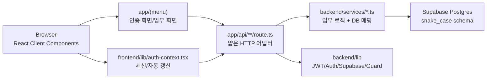
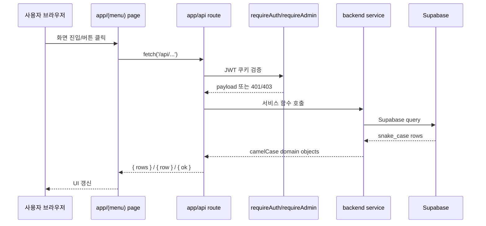
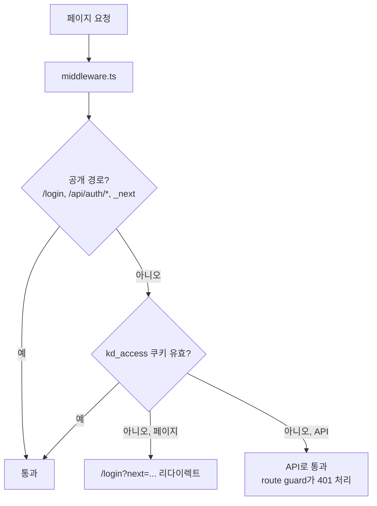
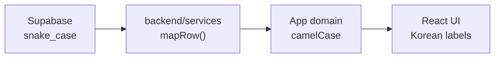
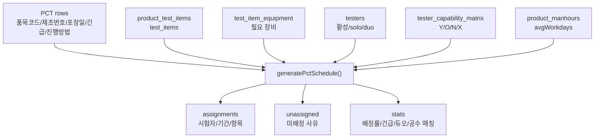
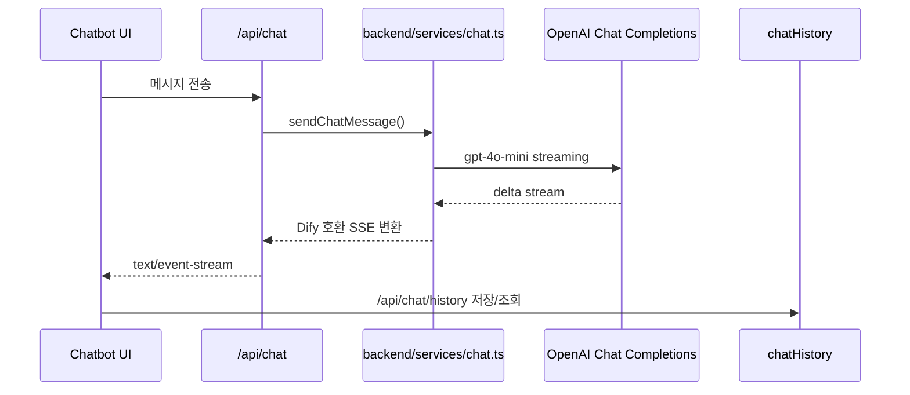

# kd_project 아키텍처 구조

작성일: 2026-06-12  
대상: 광동제약 QC 시험 관리 시스템 개발 현황 검토용

## 1. 시스템 개요

`kd_project`는 Next.js 16 App Router 기반의 QC/LIMS/QMS 웹 애플리케이션이다. 제품 시험, 시험 항목, 생산 배치, 시험자/역량, 공수, 스케줄링, 안정성 시험, 일탈/OOS/CAPA, 문서, 장비, 분석, AI 챗봇을 하나의 업무 포털 안에서 관리한다.

핵심 구조는 다음 3계층이다.

## 2. 런타임 구성

| 영역 | 구현 위치 | 역할 |
| --- | --- | --- |
| 프레임워크 | `app/` | Next.js App Router, 페이지, API route handler |
| 인증 페이지 | `app/login/page.tsx` | 공개 로그인 화면 |
| 인증 업무 화면 | `app/(menu)/**/page.tsx` | 로그인 후 접근하는 업무 화면 |
| 공통 셸 | `app/(menu)/layout.tsx` | 사이드바, 상단바, 로그아웃, 챗봇 |
| 클라이언트 공통 | `frontend/` | UI 컴포넌트, AuthProvider, 보드/스케줄 유틸 |
| 서버 업무 로직 | `backend/services/` | Supabase 쿼리, 도메인 규칙, row 매핑 |
| 서버 공통 | `backend/lib/` | JWT, 쿠키, route guard, Supabase client |
| DB 스키마 | `supabase/migrations/` | QC/PQM/Auth 테이블 및 seed |
| 공유 타입 | `types/` | 프론트/백엔드 공용 TypeScript 타입 |

## 3. 요청 흐름

### 3.1 일반 데이터 요청

### 3.2 페이지 인증 흐름

### 3.3 JWT 토큰 전략

| 토큰 | 쿠키 | 만료 | 역할 |
| --- | --- | --- | --- |
| Access token | `kd_access` | 15분 | 페이지/API 인증 |
| Refresh token | refresh cookie | 7일 | access token 자동 재발급 |

프론트엔드의 `AuthProvider`가 `/api/auth/me`, `/api/auth/refresh`, `/api/auth/logout`을 통해 세션 상태와 자동 갱신을 관리한다.

## 4. 주요 모듈 맵

### 4.1 Frontend

| 모듈 | 주요 파일 | 설명 |
| --- | --- | --- |
| 앱 셸 | `app/(menu)/layout.tsx` | 인증 업무 화면 공통 레이아웃 |
| 사이드바/챗봇 | `frontend/components/dashboard/*` | 글로벌 네비게이션, AI 챗봇 |
| UI primitives | `frontend/components/ui/*` | shadcn/ui 기반 Button, Dialog, Table 등 |
| 보드 UI | `frontend/components/board/*` | Monday 스타일 스케줄 보드 |
| 인증 컨텍스트 | `frontend/lib/auth-context.tsx` | 사용자 상태, 자동 refresh, logout |
| 스케줄 유틸 | `frontend/lib/weekly-planner.ts` | 주간 계획 계산 |
| PCT 브리지 | `frontend/lib/pct-schedule-bridge.ts` | PCT 데이터를 보드 모델로 변환 |

### 4.2 API Routes

| API | 역할 | 주요 서비스 |
| --- | --- | --- |
| `/api/auth/*` | 로그인, 로그아웃, 내 정보, refresh, 비밀번호 변경 | `users`, `auth` |
| `/api/users`, `/api/users/[id]` | 사용자 관리 | `backend/services/users.ts` |
| `/api/products` | 제품 마스터 | `products.ts` |
| `/api/test-items` | 시험 항목 마스터 | `testItems.ts` |
| `/api/product-test-items` | 제품별 시험 항목 | `productTestItems.ts` |
| `/api/product-test-items/reorder` | 제품별 시험 항목 정렬 | `productTestItems.ts` |
| `/api/tests` | 시험 접수/결과/상태 데이터 | `tests.ts` |
| `/api/batches`, `/api/batches/[id]` | 생산/시험 배치 | `batches.ts` |
| `/api/testers` | 시험자 관리 | `testers.ts` |
| `/api/tester-capabilities` | 시험자 역량 매트릭스 | `testers.ts` |
| `/api/manhours` | 제품 공수 | `manhours.ts` |
| `/api/schedules/monthly` | 월간 스케줄 | 서비스/route 내부 로직 |
| `/api/schedules/pct-generate` | PCT 스케줄 생성 | `scheduleEngine.ts` |
| `/api/qc-scheduler` | QC 스케줄 계산 | `scheduleEngine.ts` |
| `/api/dashboard` | 대시보드 집계 | route 내부 집계 |
| `/api/chat`, `/api/chat/history` | AI 챗봇 스트리밍/이력 | `chat.ts`, `chatHistory.ts` |
| `/api/google-sheet/*` | Google Sheet 연동 | route 내부 연동 |

### 4.3 Backend Services

| 서비스 | 담당 도메인 |
| --- | --- |
| `products.ts` | 제품, 카테고리, 분류 |
| `productTestItems.ts` | 제품별 시험 항목 |
| `testItems.ts` | 시험 항목 마스터 |
| `tests.ts` | QC 시험 데이터 |
| `batches.ts` | 생산 배치 |
| `testers.ts` | 시험자, 시험자 역량 |
| `manhours.ts` | 제품별 평균 공수 |
| `users.ts` | 사용자 계정, 비밀번호 |
| `scheduleEngine.ts` | PCT 스케줄 규칙 엔진, 순수 함수 |
| `chat.ts` | OpenAI `gpt-4o-mini` 기반 SSE 챗봇 |
| `chatHistory.ts` | 챗봇 대화 이력 |

서비스는 HTTP `Response`를 직접 만들지 않고, Supabase row를 앱에서 쓰는 camelCase 객체로 변환한 뒤 반환한다.

## 5. 업무 도메인별 화면 구조

| 도메인 | URL 영역 | 구현 화면 |
| --- | --- | --- |
| 홈 | `/home` | 로그인 후 홈 대시보드 |
| 제품 시험 | `/product-test/*` | 제품, 제품 등록, 제품 현황, 제품 기준, 공수 |
| 시험 관리 | `/test-mgmt/*` | 시험 마스터, 시험 항목, 시험 등록, 결과, 상태, 성적서, 시험자 |
| 스케줄 | `/schedule/*` | 월간, 주간, 주간 계획, PCT |
| 안정성 | `/stability/*` | 안정성 계획, 보고서, 현황 |
| 일탈 | `/deviation/*` | OOS, CAPA, 조사 보고 |
| 문서 | `/documents/*` | SOP, STD, 인증서, 체크리스트 |
| 장비 | `/equipment/*` | 장비 가동, 사용, 백업, AI 유지보수 |
| 분석 | `/insights/*` | 대시보드, 통계, 분석 보고 |
| 설정 | `/settings/*` | 사용자, 역할, 시스템 설정 |

## 6. 데이터 구조

### 6.1 주요 테이블 그룹

| 그룹 | 테이블 |
| --- | --- |
| 인증 | `users`, `auth_refresh_tokens` |
| QC 기본 | `managers`, `contractors`, `tests`, `stability_tests`, `deviations` |
| 챗봇 | `chat_conversations`, `chat_messages` |
| 제품/PQM | `product_categories`, `product_classifications`, `dosage_forms`, `products` |
| 시험 항목 | `test_items`, `product_test_items` |
| 배치/배정 | `production_batches`, `batch_test_assignments` |
| 시험자/역량 | `testers`, `test_capabilities`, `tester_capability_matrix` |
| 공수 | `product_manhours` |

### 6.2 명명 규칙

DB 컬럼은 `snake_case`, 애플리케이션 객체는 `camelCase`, 사용자에게 보이는 UI/메시지는 한국어를 기준으로 한다.

## 7. PCT 스케줄 엔진

`backend/services/scheduleEngine.ts`는 DB 접근이 없는 순수 함수 기반 규칙 엔진이다. 입력 데이터만 주입하면 배정 결과와 미배정 사유를 반환한다.

현재 규칙은 포장일 다음 근무일부터 시작하고, 품목별 평균 공수만큼 주말을 제외해 연속 배정한다. 전항목은 가능한 1인 또는 듀오 조에 일괄 배정하고, 개별항목은 시험 항목별 역량을 기준으로 분배한다.

## 8. AI 챗봇 구조

OpenAI API 키는 서버 환경변수에서만 읽고, 클라이언트는 `/api/chat` SSE만 소비한다.

## 9. 배포/검증 기준

| 작업 | 명령 |
| --- | --- |
| 개발 서버 | `npm run dev` |
| 타입 검사 | `npm run typecheck` |
| 린트 | `npm run lint` |
| 프로덕션 빌드 | `npm run build` |

개발 서버는 `http://localhost:3300`에서 실행된다.

## 10. 아키텍처 검토 포인트

1. API route가 계속 얇게 유지되는지 확인한다. DB 접근과 업무 규칙은 `backend/services`로 내려가야 한다.
2. Client component에서 `@backend/*`, Supabase client, secret env를 직접 import하지 않는지 확인한다.
3. 서비스별 `mapRow`가 DB `snake_case`와 앱 `camelCase` 사이의 단일 변환 지점으로 유지되는지 확인한다.
4. 인증은 `middleware.ts`와 API별 `requireAuth`/`requireAdmin`의 책임이 겹치지 않도록 유지한다.
5. PCT 스케줄 엔진은 순수 함수로 유지해 테스트 가능성과 향후 LLM/최적화 엔진 교체 가능성을 보장한다.
6. Google Sheet 연동과 dashboard 집계처럼 route 내부 로직이 커지는 영역은 서비스 분리 후보로 검토한다.
7. Supabase RLS/service-role 전략은 운영 전 명확히 정해야 한다. 현재 서비스는 공통 Supabase client를 통해 접근한다.
8. 자동 테스트가 없는 상태이므로 핵심 서비스와 스케줄 엔진부터 단위 테스트를 추가하는 것이 좋다.

